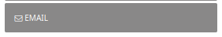
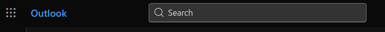
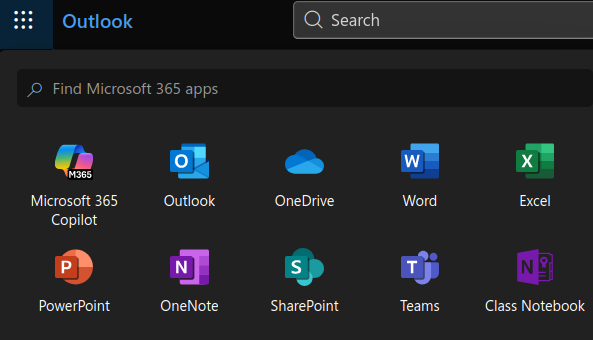
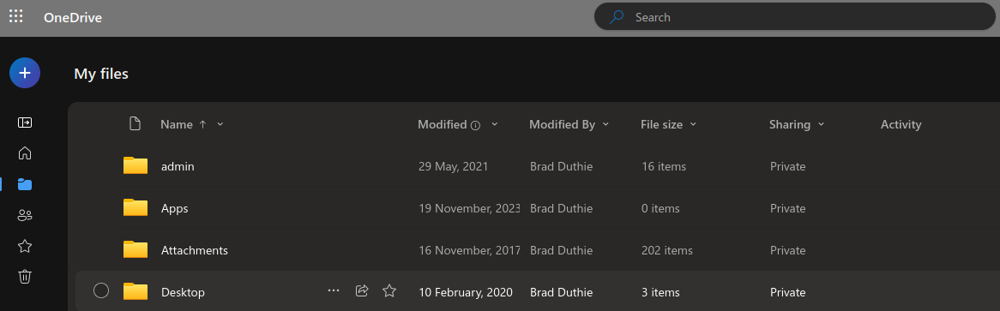
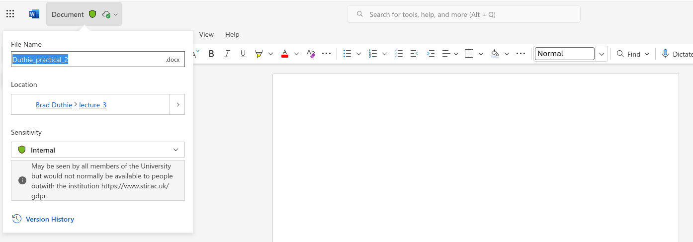
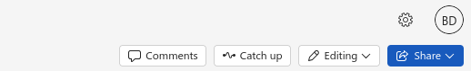
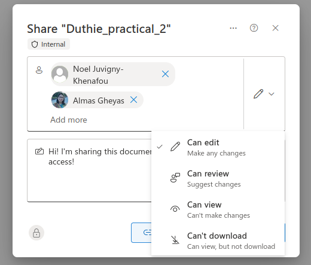
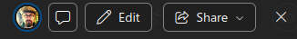
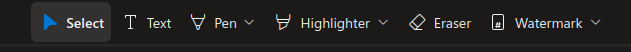
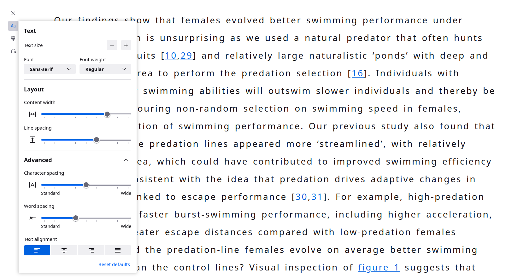

The university uses Microsoft Office 365 for office tools such as email, word processing, spreadsheets, and cloud storage. You are of course welcome to use other tools (e.g., Google, GitHub) on your own devices, but all staff and students need to be able to navigate Office 365 tools. You might be expected to work with these tools in future modules to share documents and show your work. This page will show you how to set up a new folder in your OneDrive. There are multiple ways to navigate to your OneDrive, and you can access OneDrive on a computer or a mobile phone (with your mobile phone, you need to down the OneDrive app). This page will introduce OneDrive on a computer.

To navigate to OneDrive on the computer, you can first go to your Portal. Find the button on the left-hand side of the page that says 'Email' (see below).

This button will take you to your university email account. From here, have a look at the upper left of the window. You should see a button in the very upper left that looks like the one below.

Click the button on the far left, and you will then see a new set of options, one of them being OneDrive.

Notice that you can access Microsoft Word, Excel (spreadsheet), PowerPoint (presentation slides), and Teams from your browser here. For now, choose OneDrive. What you see might be slightly different from the images above, but all of the tools should be accessible to you. Once you're in OneDrive, you can access your files. You can do this by clicking the folder icon on the left, which is highlighted in the image below.

You can see various folders in the above image (admin, Apps, Attachments, etc.). You can organise these folders however you want. One useful approach is to have a separate folder for each module. To create a new folder, click on the big blue circle with the plus sign in the upper left, which allows you to create a new file or folder. From the pull-down menu, choose 'Folder'. A box will open up that allows you to name the new folder and give it a colour. Name it, then click 'create'. The new folder will then appear in your OneDrive.

Now, click on the folder that you just created to view inside it. You'll see that the folder is empty. Within this folder, you can create other folders or files and organise them in a whatever way you prefer. Everyone has a slightly different system, but you will want some way to organise the files you need for your different modules. 

Word Documents on OneDrive
=======================================

To create a new Word document with the file (e.g., for an assignment), click the blue circle button in the upper left again. When you click 'Word Document' from the pull-down menu, a new tab should open with a Word document in front of you. The first thing to do is save the file as something memorable. You can change the name by clicking the 'Document' button in the upper left, as shown below.

You have now created a new word file, which will be automatically saved to your OneDrive. A lot of your assignments will require you to work with Word files, so this procedure is a good one to know. You can work on this file in your browser as normal, and it will save automatically. You can also share this file with others.

To share a file, find the blue 'Share' button in the upper right of the document (see below).

Click on the share button. Note that this gives you options to 'Share' and 'Copy Link'. Your document has a link that you can copy and share with anyone, or you can specify who you want to share it to using the 'Share' button. This will open a new box that allows you to share your document (see below).

In the above image, the author is going to share this document with two colleagues. This is done by putting their email addresses in the top box (you can also start typing their names, and sometimes Office 365 can find them). If you click the pencil icon to the right of their names, you can specify the permissions that you want to give them. For example, if you want them to be able to edit everything, then you can select 'Can edit'. If you just want them to be able to see the document but not make any changes, then you can select 'Can view'.  You can also type a message in the box below. When you click the blue 'Send' button, the people you are sharing with will get an email inviting them to see the document.

Sharing entire folders
====================================

Note that you can also share entire folders. You can do this by hovering over a folder in OneDrive and clicking on the ellipses (the '...') that appear (see below).

Clicking on the ellipses then choosing 'Share' can allow you to share an entire folder with people, which can be especially useful for collaborating in group work. 

PDFs and accessibility options
======================================

The PDF viewer in OneDrive allows you to annotate the PDF. To make annotations, first click the 'Edit' button in the upper right (see below).

After you click the 'Edit' button, you will see some annotation options available in the top center (see below).

All of these annotation options can be used to mark up the PDF in OneDrive, just as if you had a pen or a highlighter on a physical piece of paper. Give each of these options a try!

Accessibility options
------------------------------------

If you find it difficult to read PDFs, or if you just prefer a more accessible option, you can often read a paper directly from the website (this doesn't just work for scientific papers; it works for other website too).

A 'reader view' is available in most browsers. This toggle is usually directly to the right of the address bar (where the URL of the website is shown). You can see it highlighted in blue below, right next to the outline of the star.

The blue button to the left of the star allows you to adjust the font, text size, line spacing, word spacing, character spacing, and other options to make the text more readable. You can also change the colours and contrast of the page. Below shows an example of what a scientific manuscript looks like in reader view.

Not every website allows you to toggle to reader view, but many do. And reader view is available on most modern browsers, including Google Chrome, Firefox, and Microsoft Edge.

